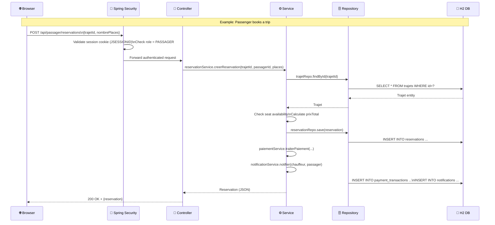
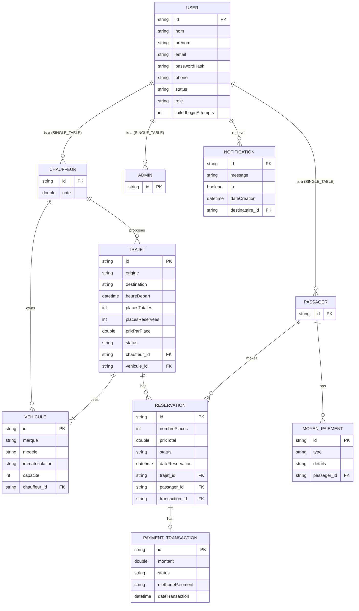

# 🚗 Covoiturage — System Architecture Diagram

> **Stack**: Spring Boot 3 · Spring Security · Spring Data JPA · H2 (in-memory) · Vanilla HTML/CSS/JS

---

## 📐 High-Level Architecture

```mermaid
graph TB
    subgraph FRONTEND["🌐 Frontend  (Static HTML/CSS/JS · served by Spring Boot)"]
        direction LR
        FE1["index.html\n🏠 Landing / Login"]
        FE2["browse.html\n🔍 Browse Trips"]
        FE3["passenger.html\n🧳 Passenger Dashboard"]
        FE4["driver.html\n🚘 Driver Dashboard"]
        FE5["admin.html\n🛡️ Admin Panel"]
        FE6["notifications.html\n🔔 Notifications"]
        JS1["js/auth.js\nAuth State & Login Flow"]
        JS2["js/api.js\nAPI Helpers & Fetch Wrappers"]
    end

    subgraph SECURITY["🔐 Security Layer  (Spring Security)"]
        SC["SecurityConfig\n• Session-based Auth\n• Role-based URL Access\n• CSRF disabled (REST)\n• Custom Login/Logout JSON handlers\n• BCrypt Password Encoder"]
        UDS["UserDetailsServiceImpl\n• Load user by email\n• Map roles to GrantedAuthority"]
    end

    subgraph CONTROLLERS["📡 REST API Controllers  (/api/**)"]
        direction TB
        AC["AuthController\nPOST /api/auth/register\nPOST /api/auth/login\nPOST /api/auth/logout\nGET  /api/auth/me"]
        TC["TrajetController\nGET  /api/trajets/disponibles\nPOST /api/chauffeur/trajets\nPUT  /api/chauffeur/trajets/{id}\nDEL  /api/chauffeur/trajets/{id}"]
        RC["ReservationController\nPOST /api/passager/reservations\nGET  /api/passager/reservations\nDEL  /api/passager/reservations/{id}"]
        EC["EvaluationController\nPOST /api/evaluations"]
        NC["NotificationController\nGET  /api/notifications\nPUT  /api/notifications/{id}/lu"]
        ADC["AdminController\nGET  /api/admin/users\nPUT  /api/admin/users/{id}/status\nGET  /api/admin/stats"]
        PC["PassagerController\nGET  /api/passager/profil\nPUT  /api/passager/profil"]
        CC["ChauffeurController\nGET  /api/chauffeur/profil\nPOST /api/chauffeur/vehicules\nGET  /api/chauffeur/vehicules"]
    end

    subgraph SERVICES["⚙️ Service Layer  (Business Logic)"]
        direction LR
        AS["AuthService / Impl\n• Register (encode pwd)\n• Login validation\n• Failed attempts tracking"]
        TS["TrajetService / Impl\n• Create / Update / Cancel trip\n• Seat availability check\n• Status transitions"]
        RS["ReservationService / Impl\n• Book seats (atomic)\n• Cancellation (24h rule)\n• Trigger payment\n• Send notification"]
        PS["PaiementService / Impl\n• Process payment\n• Refund on cancel\n• PaymentTransaction record"]
        NS["NotificationService / Impl\n• Create notifications\n• Mark as read"]
        ES["EvaluationService / Impl\n• Rating submission\n• Link to completed trip"]
    end

    subgraph EXCEPTIONS["🚨 Exception Handling"]
        GEH["GlobalExceptionHandler\n@RestControllerAdvice\n• ResourceNotFoundException → 404\n• CompteExistantException → 409\n• TrajetCompletException → 409\n• AnnulationHorsDelaiException → 400\n• PaiementEchouéException → 402\n• UtilisateurInactifException → 403"]
    end

    subgraph REPOSITORIES["🗄️ Repository Layer  (Spring Data JPA)"]
        direction LR
        UR["UserRepository"]
        TR["TrajetRepository"]
        RR["ReservationRepository"]
        NR["NotificationRepository"]
        VR["VehiculeRepository"]
        PR["PaymentTransactionRepository"]
        MPR["MoyenPaiementRepository"]
        CHR["ChauffeurRepository"]
        PAR["PassagerRepository"]
        ADR["AdminRepository"]
    end

    subgraph MODELS["📦 Domain Model  (JPA Entities)"]
        direction TB
        subgraph USERS["User Hierarchy — SINGLE_TABLE inheritance"]
            U["User (abstract)\n• id (UUID)\n• nom, prenom\n• email (unique)\n• passwordHash\n• phone\n• status: ACTIF | SUSPENDU | INACTIF\n• failedLoginAttempts"]
            CH["Chauffeur\n↳ User\n• note (rating avg)\n• trajetsProposes List\n• vehicules List"]
            PA["Passager\n↳ User\n• historiqueReservations List\n• moyensPaiement List"]
            AD["Admin\n↳ User"]
        end

        TJ["Trajet\n• id (UUID)\n• origine, destination\n• heureDepart\n• placesTotales / placesReservees\n• prixParPlace (DT)\n• status: PREVU | COMPLET | TERMINE | ANNULE\n• chauffeur (FK)\n• vehicule (FK)"]

        RES["Reservation\n• id (UUID)\n• nombrePlaces\n• prixTotal\n• status: EN_ATTENTE | CONFIRMEE | ANNULEE\n• dateReservation\n• trajet (FK)\n• passager (FK)\n• transaction (FK)"]

        VH["Vehicule\n• id (UUID)\n• marque, modele\n• immatriculation\n• capacite"]

        PT["PaymentTransaction\n• id (UUID)\n• montant\n• status: PENDING | SUCCESS | REFUNDED\n• methodePaiement\n• dateTransaction"]

        MP["MoyenPaiement\n• id (UUID)\n• type (CARTE | PAYPAL)\n• details"]

        NOT["Notification\n• id (UUID)\n• message\n• lu (boolean)\n• dateCreation\n• destinataire (FK)"]
    end

    subgraph DATABASE["💾 Database  (H2 In-Memory)"]
        DB[("H2 Database\njdbc:h2:mem:covoiturage\n\n• users\n• trajets\n• reservations\n• vehicules\n• payment_transactions\n• moyens_paiement\n• notifications")]
        DI["DataInitializer\n@Component · @Transactional\n• Seeds admin user\n• Seeds sample drivers\n• Seeds sample trips"]
        H2C["H2 Console\n/h2-console"]
    end

    %% Frontend → Security
    FRONTEND -->|"HTTP Requests\nfetch() with credentials"| SECURITY

    %% Security → Controllers
    SECURITY -->|"Authenticated + Authorized\nrequests forwarded"| CONTROLLERS

    %% Controllers → Services
    AC --> AS
    TC --> TS
    RC --> RS
    RS --> PS
    RS --> NS
    EC --> ES
    NC --> NS
    ADC --> AS
    PC --> AS
    CC --> TS

    %% Services → Repositories
    AS --> UR
    TS --> TR
    TS --> VR
    TS --> CHR
    RS --> RR
    RS --> TR
    RS --> PAR
    PS --> PR
    PS --> MPR
    NS --> NR
    ES --> RR

    %% Repositories → Database
    REPOSITORIES --> DATABASE

    %% Exception handler covers all controllers
    CONTROLLERS -.->|"throws exceptions"| GEH
    SERVICES -.->|"throws exceptions"| GEH

    %% DataInitializer populates DB on startup
    DI --> DATABASE
```



---

## 🏗️ Component Interaction Map



---

## 🔐 Security & Role Matrix

| Endpoint Pattern | PASSAGER | CHAUFFEUR | ADMIN | Guest |
|---|:---:|:---:|:---:|:---:|
| `GET /api/trajets/disponibles` | ✅ | ✅ | ✅ | ✅ |
| `POST /api/auth/register` | ✅ | ✅ | ✅ | ✅ |
| `POST /api/auth/login` | ✅ | ✅ | ✅ | ✅ |
| `GET /api/passager/**` | ✅ | ❌ | ❌ | ❌ |
| `POST /api/passager/reservations` | ✅ | ❌ | ❌ | ❌ |
| `POST /api/chauffeur/trajets` | ❌ | ✅ | ❌ | ❌ |
| `GET /api/chauffeur/vehicules` | ❌ | ✅ | ❌ | ❌ |
| `GET /api/admin/**` | ❌ | ❌ | ✅ | ❌ |
| `PUT /api/admin/users/{id}/status` | ❌ | ❌ | ✅ | ❌ |

---

## 📊 Domain Model Entity Relationships (ERD)



---

## 🗂️ Package Structure Summary

```
com.example.Covoiturage/
│
├── 📁 config/
│   ├── SecurityConfig.java         ← Spring Security, roles, filters, auth handlers
│   └── CorsConfig.java             ← CORS policy
│
├── 📁 controller/                  ← REST endpoints (@RestController)
│   ├── AuthController.java         ← /api/auth/**
│   ├── TrajetController.java       ← /api/trajets/** & /api/chauffeur/trajets
│   ├── ReservationController.java  ← /api/passager/reservations
│   ├── PassagerController.java     ← /api/passager/profil
│   ├── ChauffeurController.java    ← /api/chauffeur/profil & vehicules
│   ├── EvaluationController.java   ← /api/evaluations
│   ├── NotificationController.java ← /api/notifications
│   └── AdminController.java        ← /api/admin/**
│
├── 📁 service/                     ← Interfaces + Implementations
│   ├── AuthService.java
│   ├── TrajetService.java
│   ├── ReservationService.java
│   ├── PaiementService.java
│   ├── NotificationService.java
│   ├── EvaluationService.java
│   ├── UserDetailsServiceImpl.java ← Spring Security user loading
│   └── impl/
│       ├── AuthServiceImpl.java
│       ├── TrajetServiceImpl.java
│       ├── ReservationServiceImpl.java  ← Core booking logic, most complex
│       ├── PaiementServiceImpl.java
│       ├── NotificationServiceImpl.java
│       └── EvaluationServiceImpl.java
│
├── 📁 model/                       ← JPA Entities
│   ├── User.java (abstract)
│   ├── Chauffeur.java
│   ├── Passager.java
│   ├── Admin.java
│   ├── Trajet.java
│   ├── Reservation.java
│   ├── Vehicule.java
│   ├── PaymentTransaction.java
│   ├── MoyenPaiement.java
│   ├── Notification.java
│   └── enums/
│       ├── UserRole.java           ← PASSAGER | CHAUFFEUR | ADMIN
│       ├── UserStatus.java         ← ACTIF | SUSPENDU | INACTIF
│       ├── TrajetStatus.java       ← PREVU | COMPLET | TERMINE | ANNULE
│       ├── ReservationStatus.java  ← EN_ATTENTE | CONFIRMEE | ANNULEE
│       └── PaymentStatus.java      ← PENDING | SUCCESS | REFUNDED
│
├── 📁 repository/                  ← Spring Data JPA (extends JpaRepository)
│   ├── UserRepository.java
│   ├── TrajetRepository.java
│   ├── ReservationRepository.java
│   ├── ChauffeurRepository.java
│   ├── PassagerRepository.java
│   ├── AdminRepository.java
│   ├── VehiculeRepository.java
│   ├── NotificationRepository.java
│   ├── MoyenPaiementRepository.java
│   └── PaymentTransactionRepository.java
│
├── 📁 dto/                         ← Request/Response Data Transfer Objects
│   ├── RegisterRequest.java        ← Registration payload
│   ├── AuthResponse.java           ← Login response
│   ├── TrajetRequest.java          ← Trip creation payload
│   ├── ReservationRequest.java     ← Booking payload
│   ├── VehiculeRequest.java        ← Vehicle registration payload
│   └── ApiResponse.java            ← Generic API response wrapper
│
├── 📁 exception/                   ← Custom Exceptions + Global Handler
│   ├── GlobalExceptionHandler.java ← @RestControllerAdvice
│   ├── ResourceNotFoundException.java
│   ├── CompteExistantException.java
│   ├── TrajetCompletException.java
│   ├── AnnulationHorsDelaiException.java
│   ├── PaiementEchouéException.java
│   └── UtilisateurInactifException.java
│
├── DataInitializer.java            ← Seed data on startup
└── CovoiturageApplication.java     ← @SpringBootApplication entry point

resources/
├── application.properties          ← Port 8081, H2 config, JPA DDL
├── application-dev.properties      ← Dev profile overrides
└── static/                        ← Frontend (served as static files)
    ├── index.html                  ← Landing / Login page
    ├── browse.html                 ← Public trip browser
    ├── passenger.html              ← Passenger dashboard
    ├── driver.html                 ← Driver dashboard
    ├── admin.html                  ← Admin panel
    ├── notifications.html          ← Notifications page
    ├── css/                        ← Stylesheets
    └── js/
        ├── auth.js                 ← Auth state management
        └── api.js                  ← Fetch wrappers & API helpers
```

---

## ⚡ Key Design Decisions

| Decision | Implementation |
|---|---|
| **Inheritance Strategy** | `SINGLE_TABLE` on `users` table — discriminator column `role` |
| **Authentication** | Spring Security session-based (JSESSIONID cookie) |
| **Password Storage** | BCrypt hashing via `PasswordEncoder` |
| **Authorization** | URL-pattern + `@EnableMethodSecurity` with `@PreAuthorize` |
| **Database** | H2 in-memory (`create-drop`) — dev/demo only |
| **Booking atomicity** | Seat decrement + payment + notification in single `@Transactional` |
| **Cancellation rule** | Business rule: only cancellable >24h before departure |
| **API errors** | Centralized `GlobalExceptionHandler` → structured JSON errors |
| **Circular ref. prevention** | `@JsonIgnoreProperties`, `@JsonIgnore`, `@JsonBackReference` |
